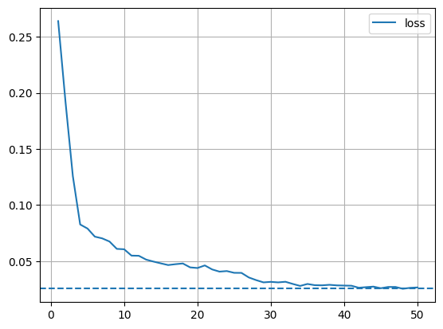
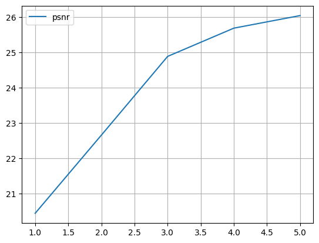
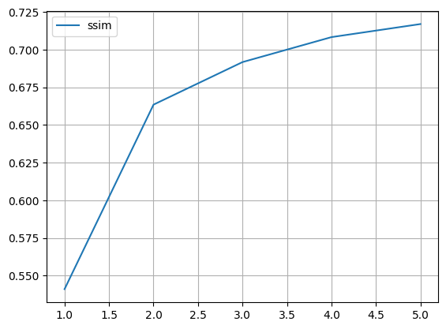
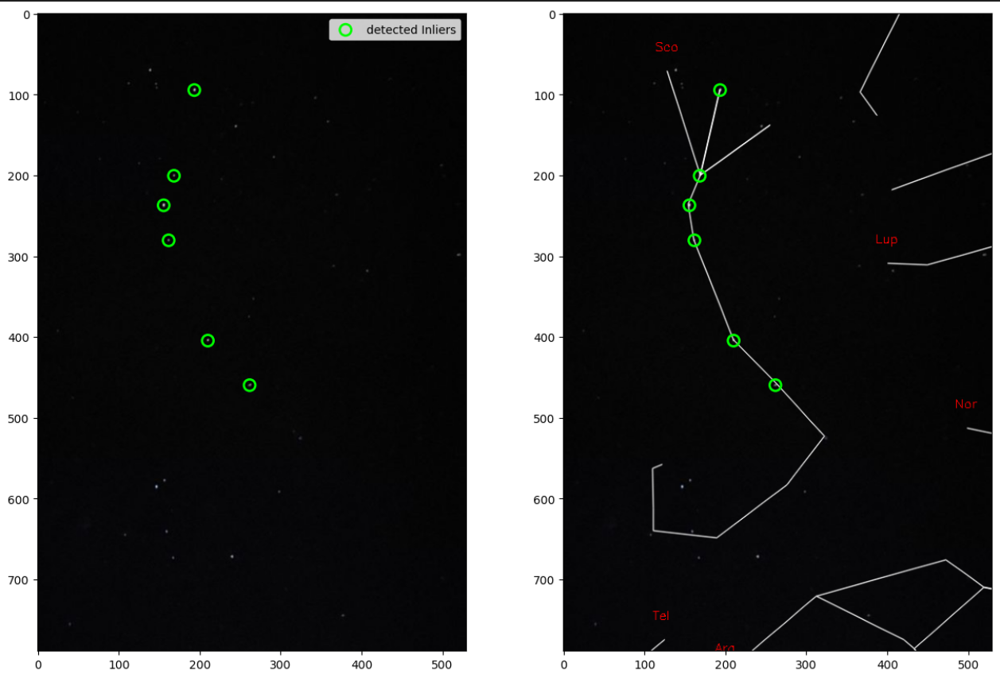
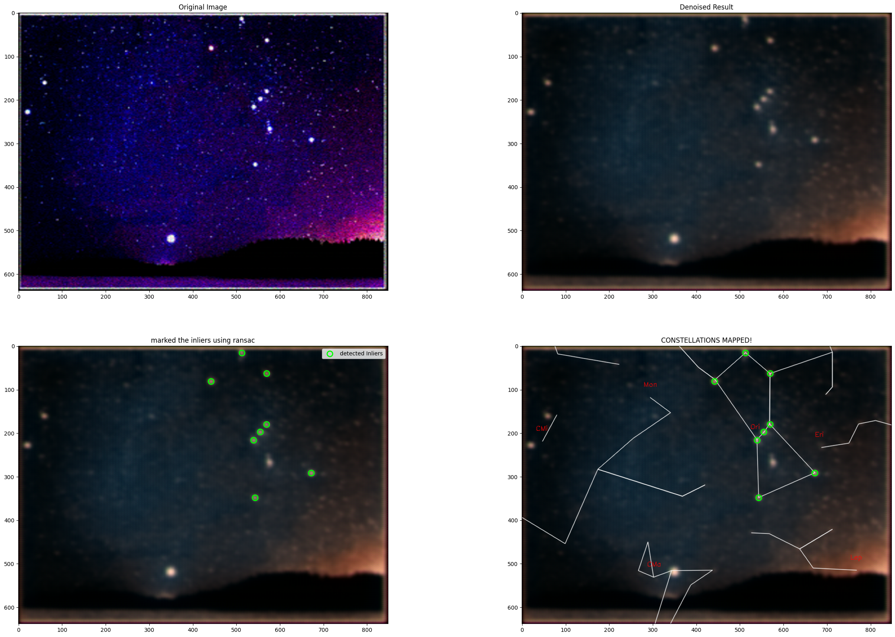
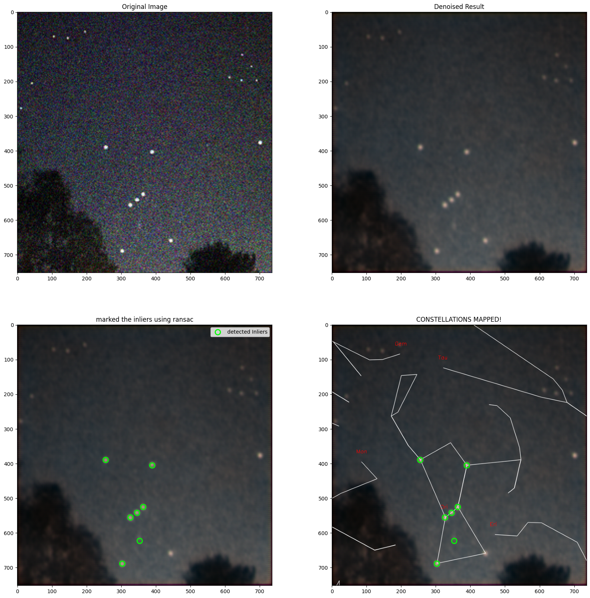

# BYOP_AstroVision

-->AstroVision is a deep learning model that denoises low-light images mostly taken form smartphones and cameras
-->The model is based on an **Astr U-Net architecture**, which is a modified U-Net using the **LeakyReLU activations**.
-->The best performance was achieved at **epoch 34**.

## Loss:

## PSNR

## SSIM

## Example Outputs

**Only Denoising**

**Only Constellation Marking**

**Denoising and Constellations Mapped**

